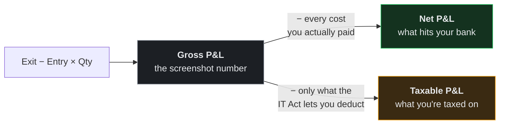
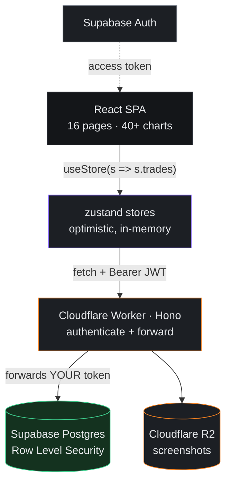

<div align="center">

# 📓 LedgerX

### Your broker shows you one number. There are actually three.

A dark-theme trading journal for Indian markets, where brokerage, STT, stamp duty, GST, DP charges, pledge fees and margin interest aren't a footnote — they're the whole point.

<p>
  
  
  
  
  
  
  
</p>

</div>

---

## The three numbers

Close a position in India and there are three different, equally real answers to *"what did I make?"*



Most journals track the first. Decent ones track the second.

**LedgerX tracks all three** — because they genuinely diverge. Sell equity for a capital gain and STT, DP charges and MTF interest get **added back** to your tax base. Trade crypto under §115BBH and **nothing** is deductible. Get that wrong and your advance-tax planning is wrong in the expensive direction.

That distinction is the reason this project exists.

---

## What's inside

Sixteen pages. Here's the tour.

### 📊 The journal

| | |
|---|---|
| **Dashboard** | Equity curve, cumulative P&L, month + quarter comparisons, win-rate donut, calendar heatmap, recent trades |
| **Trades** | Every execution in scope — filter, sort, bulk-select, CSV in/out, detail drawer |
| **Trade form** | Charges and tax recompute live as you type. Auto from the rate card, or paste your contract-note total |
| **Analytics** | R-multiple distribution, performance by strategy / tag / setup, day-of-week, hour-of-day, long vs short |
| **Calendar** | Daily P&L heatmap — click any day, see what you did |
| **Journal** | Reflections with mood tracking, linked to the trades that caused them |

### 💸 The uncomfortable pages

| | |
|---|---|
| **Charges & Fees** | Every levy, broken out by component, as a % of gross. This is the page that changes how you trade |
| **Tax Report** | Full FY computation — slab-wise business income, §111A STCG, §112A LTCG with the ₹1.25L exemption, §115BBH crypto, §87A rebate, cess |
| **MTF Tracker** | A sub-app for margin positions: daily interest accrual, lot-wise cost basis, live break-even, and health tiers for when interest is quietly eating the trade |
| **Accounts** | Multi-broker, capital allocation, deposits/withdrawals, per-account performance |

### 🎯 Planning

| | |
|---|---|
| **Goals** | Monthly %-of-portfolio targets, capital planner, pace tracking, discipline scoring, milestones |
| **Watchlist** | Planned setups with alert prices |
| **Reports** | Downloadable performance / trade-log / tax summaries, over a period independent of the global filters |
| **Settings** | Profile, appearance, editable charge + tax rate cards, export / import / migrate |

## Screenshots

<!-- Drop images in docs/ and uncomment:
| Dashboard | Charges |
|---|---|
|  |  |
-->

_Coming soon._

---

## 🔬 The engine

The interesting code lives in [`src/lib/tradeMath.ts`](src/lib/tradeMath.ts) and [`src/lib/incomeTax.ts`](src/lib/incomeTax.ts).

### Segment decides everything

A trade isn't just "equity." It's *delivery* equity or *intraday* equity or *MTF* equity — and each one is charged under a completely different formula.

| Segment | Is | The catch |
|---|---|---|
| `Delivery` | Equity CNC | STT on **both** legs, plus a DP charge every time you sell |
| `Intraday` | Equity MIS | STT sell-side only, no DP |
| `MTF` | Equity e-Margin | Pledge **and** unpledge fees, plus interest ticking daily |
| `FnO` | Options & Futures | Its own STT and stamp rates entirely |
| `Other` | Forex, Crypto, Commodity | |

Even the exchange matters: NSE cash equity is `0.00297%`, BSE is `0.00375%`. One line item, different number, and LedgerX tracks which venue filled you.

### Where the tax base diverges

```
netPnl     = grossPnl − charges.total           ← every cost, no exceptions
taxablePnl = grossPnl − deductible charges only ← depends on tax category
```

| Category | Deductible |
|---|---|
| Intraday (business income) | Everything |
| STCG / LTCG (capital gains) | Everything **except** STT, DP charges, MTF interest |
| Crypto (§115BBH VDA) | **Nothing** |

Two numbers, deliberately different, computed per trade and stored on the row.

### Rate cards you can edit

Ships with a Groww-shaped default — 0.1% brokerage with a ₹5 floor, ₹20 DP per sell, ₹20 per pledge request, 14.95% p.a. MTF interest. Switched brokers? Edit them in **Settings → Charge rates** and everything recomputes.

Tax parameters for FY 2025-26 are editable too: ₹4,00,000 basic exemption, ₹12,00,000 §87A threshold with a ₹60,000 max rebate, 4% cess.

> ⚠️ **This is not tax advice.** It's a planning tool. Reconcile against your contract notes and talk to a CA before you file.

---

## 🏗 How it's built



| Layer | Runs on | Job |
|---|---|---|
| **Frontend** | Cloudflare Pages | The whole app. All the maths happens here |
| **API** | Cloudflare Worker + Hono | Check the token, forward the request. ~100 lines |
| **Database** | Supabase Postgres | 8 tables, 32 RLS policies. Decides who sees what |
| **Auth** | Supabase Auth | Identity, sessions, token refresh |
| **Screenshots** | Cloudflare R2 | WebP blobs, namespaced per user |

---

## 🚶 Follow one trade through the system

The clearest way to understand the architecture is to watch a single trade travel through it.

**1. You hit Save on the trade form.**
The browser computes brokerage, STT, exchange fees, SEBI, stamp duty, GST, DP, the tax category and the R-multiple — all in [`tradeMath.ts`](src/lib/tradeMath.ts). **Nothing is asked of the server.**

**2. The store updates immediately.**
`addTrade(trade)` pushes it into the zustand array. Your table re-renders instantly. As far as the UI is concerned, done.

**3. The API call fires in the background.**
The store never awaits it. If the network is slow, you don't wait; if it fails, a toast tells you.

**4. The Worker checks who you are.**
It validates your Supabase token and — crucially — **forwards that same token** to Postgres rather than using a master key. It never learns which rows are yours.

**5. Postgres decides.**
An RLS policy rewrites your query to `WHERE user_id = auth.uid()` at the database level. The Worker couldn't fetch someone else's trades even if a bug asked it to.

**6. Reading it back is even simpler.**
On the next load, the Worker pipes the response bytes straight to your browser without parsing them. It moves data it doesn't understand — which is exactly why it's fast.

**Net effect:** the server is a doorman, not a brain. Every calculation that makes LedgerX useful runs on your machine.

---

## 💡 Decisions worth knowing about

Five choices that shaped everything else.

### The Worker never reads what it sends

```js
// ❌ CPU scales with your dataset
const { data } = await supabase.from("trades").select("*");
return Response.json(data);

// ✅ CPU stays flat forever
const res = await fetch(postgrestUrl, { headers });
return new Response(res.body);
```

Cloudflare's free tier allows **10 ms of CPU per request**. Benchmarked on real data, `JSON.parse` + `stringify` costs **~2.7 µs per trade** — so parsing would blow the budget somewhere past 3,700 trades.

Piping the raw stream costs the same whether you have 25 trades or 250,000. The limit stopped being a scaling concern and became a non-issue.

### The database is the security boundary, not the code

Every table has four RLS policies scoped `to authenticated`. The Worker holds **no `service_role` key** — not in the code, not in an env var, nowhere.

The read handler deliberately omits a `user_id` filter, with this comment:

> *"RLS scopes; no user_id filter (that would mask an RLS misconfiguration)"*

If the Worker had a bug tomorrow, Postgres would still refuse to send another user's rows. Security that doesn't depend on remembering.

### Dates are `text`, not `timestamptz`

Looks wrong. Isn't.

The app stores `"2025-01-01T16:17"` — the raw value from a `datetime-local` input. No seconds, no timezone. A `timestamptz` column would hand back `"2025-01-01T16:17:00+00:00"` and quietly break every date picker in the app.

All date maths already runs client-side in `date-fns`. Storing text guarantees a byte-identical round trip. Boring beats clever.

### Money is `double precision`, not `numeric`

JavaScript numbers *are* float64. `double precision` round-trips exactly.

`numeric` sounds safer, but it risks arriving as a string — and every function in [`metrics.ts`](src/lib/metrics.ts) expects a `number`. One type mismatch would silently corrupt every P&L calculation in the app.

### No ORM

Workers run V8 isolates, not Node. Prisma would need driver adapters or a paid proxy. Plain `fetch` against PostgREST needs neither — and it's what makes pass-through streaming possible at all, since there's no client insisting on deserializing your rows.

---

## 🚀 Run it

```bash
git clone https://github.com/Saurabh-0312/LedgerX.git
cd LedgerX
npm install
cp .env.example .env      # fill in the three VITE_* values
```

Two terminals:

```bash
cd worker && npx wrangler dev    # API on :8787 (R2 simulated, no remote needed)
npm run dev                      # app on :5173
```

→ **http://localhost:5173** — sign in, and your data loads from Postgres. New accounts start empty.

| Command | |
|---|---|
| `npm run dev` | Dev server, HMR |
| `npm run build` | Type-check, then build to `dist/` |
| `npm run typecheck` | Types only |
| `npm run preview` | Serve the build on :4173 |

`npm run build` runs `tsc --noEmit` first and **fails on any type error.** Deliberate.

---

## 🗺 Layout

```
src/
├── types.ts                 # The domain model. Single source of truth.
├── App.tsx                  # Routes, lazy-loaded
├── index.css                # Tailwind v4 @theme tokens
│
├── store/
│   ├── useStore.ts          # Trades, accounts, journal, goals, watchlist,
│   │                        #   settings — API-backed, optimistic, synchronous
│   ├── useMtfStore.ts       # MTF tracker — deliberately isolated
│   ├── settingsSync.ts      # Single debounced writer for the shared settings row
│   ├── useFilteredTrades.ts # Global date-range + account scoping
│   └── toast.ts
│
├── lib/
│   ├── api.ts               # fetch wrapper — JWT, retry-once-on-401, bulk key padding
│   ├── supabase.ts          # Auth client
│   ├── images.ts            # WebP conversion + authenticated R2 access
│   ├── backup.ts            # Lossless export / import
│   ├── migrateLocal.ts      # One-time localStorage → cloud migration
│   ├── metrics.ts           # All performance math. Pure. Takes Trade[].
│   ├── tradeMath.ts         # Charges, tax category, R-multiple
│   ├── incomeTax.ts         # FY engine — slabs, 87A, cess
│   ├── format.ts · csv.ts · rng.ts · sampleData.ts
│   └── mtf/                 # MTF domain: types, calc, palette, export
│
├── components/
│   ├── ui/                  # Card, Button, Badge, Field, Modal, Table…
│   ├── charts/              # chartTheme + shared ChartTooltip
│   ├── RequireAuth.tsx      # Guards the app shell
│   └── layout/              # AppLayout, Sidebar, Topbar, CommandPalette
│
└── pages/                   # One folder per page for its subcomponents

worker/src/
├── index.ts                 # CORS, auth middleware, routing, keep-alive cron
├── crud.ts                  # Shared entity CRUD (pass-through streaming)
├── settings.ts              # user_settings singleton
└── screenshots.ts           # R2 upload / download

supabase/migrations/         # 8 tables, RLS, grants — applied
```

`@/` → `src/`. Import `@/lib/metrics`, never `../../lib/metrics`.

---

## 🧱 Patterns that keep it coherent

### Compute is pure

Every function in [`metrics.ts`](src/lib/metrics.ts) takes `Trade[]` and returns data. No hooks, no store access, no side effects — `computeKpis`, `equityCurve`, `drawdownSeries`, `dailyPnl`, `monthlyPnl`, `pnlBy`, `rHistogram`, `dayOfWeekPerf`, `hourOfDayPerf`, `calendarMonth`.

Only `status === "Closed"` trades carry P&L, tax and R. The helpers filter internally so you don't have to remember.

### One filter to rule them all

The topbar date-range and account pickers reach every page through `useFilteredTrades()`. Pages never touch `trades` raw. Two deliberate exceptions: **Tax Report** has its own FY selector, **Reports** has its own period.

`datasetToday()` anchors "today" to the newest trade rather than the wall clock.

### Optimistic, then synced

Store actions are **synchronous** — that's not an accident. Making them `async` would have forced edits across 30 call sites in 11 files and turned a storage swap into an app rewrite. Instead each action updates state instantly and fires its API call in the background.

`settings` is one shared Postgres row written through a single debounced path, so the two stores can never overwrite each other's columns.

### MTF interest is derived, never stored

A margin position stores only *"bought 8 Jul, 25 shares at ₹1153.50"*. Open it in October and the browser subtracts the dates and computes the interest fresh.

No cron job. No stale values. No server maths. Closed positions freeze a snapshot; open ones recalculate on every render.

### The design system

Semantic tokens only, defined in `src/index.css`. No raw hex in class names, ever.

| | |
|---|---|
| Surfaces | `bg-base` → `bg-surface` → `bg-raised` |
| Text | `text-ink` / `text-muted` / `text-faint` |
| Status | `text-profit` / `text-loss` / `text-warning` / `text-info` |
| Brand | `accent` — electric violet `#7c5cff` |

Chart colours are a separate, accessibility-validated system: 8 fixed categorical slots assigned **in order, never cycled**, plus a dedicated P&L pair. Reach for `chartTheme`, never a hand-picked hex.

[`CONTRACT.md`](CONTRACT.md) pins the full shared API — it's what the pages were built against.

---

## 🔒 Your data

Your journal lives in **your own account**, isolated by Postgres Row Level Security. Sign in and you see only your rows — enforced by the database, not by application code.

| Where | Holds |
|---|---|
| **Postgres** (8 tables, RLS) | Trades, accounts, cash, journal, goals, targets, watchlist, settings, MTF |
| **Cloudflare R2** | Screenshots — WebP, namespaced by user id |
| **`localStorage`** | The pre-cloud copy, kept **read-only** as an offline backup |

**No analytics, no telemetry, no third-party tracking.**

### Back it up

**Settings → Data management → Export JSON** — a complete, lossless snapshot: every collection, your settings, and the full MTF store. **Import** restores all of it.

> ⚠️ The free Supabase tier has **no automatic backups.** That export is your safety net — run it occasionally.

---

## 💰 What it costs

**$0/month.** Every component sits on a permanent free tier — no trial clock.

| Resource | Free | Runs out at |
|---|---|---|
| Pages bandwidth | unlimited | never |
| Worker requests | 100,000/day | ~3,000 users |
| Worker CPU | 10 ms/request | never (pass-through) |
| Postgres | 500 MB | ~640,000 trades |
| **Supabase egress** | **5 GB/month** | **~150 users** ← first to bind |
| R2 storage | 10 GB | ~260,000 screenshots |
| Auth | 50,000 MAU | never, realistically |

At **~778 bytes per trade** (measured, not estimated), a solo user would need centuries to trouble any of these. The first real ceiling is Supabase egress — and by then $25/mo buys 50× the headroom.

Two free-tier quirks worth knowing: **no backups** (hence the export button) and a **7-day idle pause** — handled by a daily cron on the Worker that makes one trivial read so the project never sleeps.

---

## ☁️ Deploy

```bash
cd worker
npx wrangler r2 bucket create ledgerx-screenshots   # once
npx wrangler deploy                                  # Worker + R2 binding + cron
```

Then connect the repo to **Cloudflare Pages**: build `npm run build`, output `dist`, `NODE_VERSION=20`, and set the three `VITE_*` env vars — with `VITE_API_URL` pointing at the deployed Worker.

⚠️ Vite inlines `VITE_*` at **build** time, so **redeploy Pages after adding them** or they won't exist in the bundle.

The SPA fallback in [`public/_redirects`](public/_redirects) isn't optional — without it every route except `/` 404s on hard refresh. Classic.

---

## ✅ Shipped

Migrated from browser localStorage to a full cloud stack across 11 phases — each one independently testable, committable and revertible.

- [x] **Lossless backup** — export/import covering every collection
- [x] **Postgres schema** — 8 tables, 32 RLS policies, explicit grants
- [x] **Cloudflare Worker API** — Hono, JWT-forwarding, pass-through streaming
- [x] **Real auth** — Supabase email/password, session-guarded shell
- [x] **Store swap** — both zustand stores moved to the API, zero call sites changed
- [x] **Verified migration** — local data uploaded, checked field-by-field
- [x] **Screenshots → R2** — WebP on upload, never data-URIs in a row
- [x] **Pages deploy** + daily keep-alive cron + 401 token refresh

**~6% of the codebase changed.** Every page, chart and calculation is exactly what it was — the storage boundary held.

Still on the wishlist: automated cloud backups, Google sign-in, password reset, and broker API sync (Zerodha / Groww).

---

## 🤝 Contributing

Personal project, but issues and ideas are welcome. If you send a PR:

1. `npm run typecheck` passes — the build enforces it anyway
2. Design tokens and `chartTheme` only, no raw hex
3. Read `CONTRACT.md` before touching `store/`, `lib/`, or `components/ui/`
4. New persisted field? Add the column, the RLS grant, and the mapper

---

## 📄 License

None chosen yet — which legally means **all rights reserved**. Read it, learn from it, but reuse isn't licensed. Want that to change? Drop in a `LICENSE` file (MIT is the usual pick).

---

<div align="center">

**Built for traders who'd rather know the real number.**

</div>
