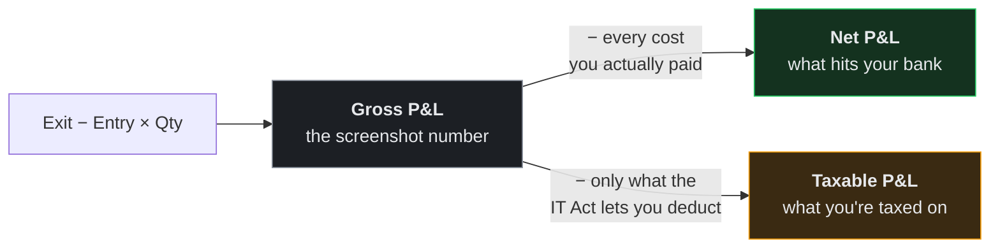
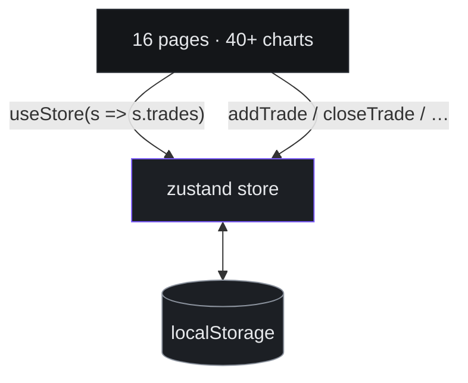

<div align="center">

# 📓 LedgerX

### Your broker shows you one number. There are actually three.

A dark-theme trading journal for Indian markets, where brokerage, STT, stamp duty, GST, DP charges, pledge fees and margin interest aren't a footnote — they're the whole point.

<p>
  
  
  
  
  
  
</p>

</div>

---

## The three numbers

Close a position in India and there are three different, equally real answers to *"what did I make?"*



Most journals track the first. Decent ones track the second.

**LedgerX tracks all three** — because they genuinely diverge. Sell equity for a capital gain and STT, DP charges and MTF interest get **added back** to your tax base. Trade crypto under §115BBH and **nothing** is deductible. Get that wrong and your advance-tax planning is wrong in the expensive direction.

That distinction is the reason this project exists.

---

## What's inside

Sixteen pages. Here's the tour.

### 📊 The journal

| | |
|---|---|
| **Dashboard** | Equity curve, cumulative P&L, month + quarter comparisons, win-rate donut, calendar heatmap, recent trades |
| **Trades** | Every execution in scope — filter, sort, bulk-select, CSV in/out, detail drawer |
| **Trade form** | Charges and tax recompute live as you type. Auto from the rate card, or paste your contract-note total |
| **Analytics** | R-multiple distribution, performance by strategy / tag / setup, day-of-week, hour-of-day, long vs short |
| **Calendar** | Daily P&L heatmap — click any day, see what you did |
| **Journal** | Reflections with mood tracking, linked to the trades that caused them |

### 💸 The uncomfortable pages

| | |
|---|---|
| **Charges & Fees** | Every levy, broken out by component, as a % of gross. This is the page that changes how you trade |
| **Tax Report** | Full FY computation — slab-wise business income, §111A STCG, §112A LTCG with the ₹1.25L exemption, §115BBH crypto, §87A rebate, cess |
| **MTF Tracker** | A sub-app for margin positions: daily interest accrual, lot-wise cost basis, live break-even, and health tiers for when interest is quietly eating the trade |
| **Accounts** | Multi-broker, capital allocation, deposits/withdrawals, per-account performance |

### 🎯 Planning

| | |
|---|---|
| **Goals** | Monthly %-of-portfolio targets, capital planner, pace tracking, discipline scoring, milestones |
| **Watchlist** | Planned setups with alert prices |
| **Reports** | Downloadable performance / trade-log / tax summaries, over a period independent of the global filters |
| **Settings** | Profile, appearance, editable charge + tax rate cards, export / import / reset |

## Screenshots

<!-- Drop images in docs/ and uncomment:
| Dashboard | Charges |
|---|---|
|  |  |
-->

_Coming soon._

---

## 🔬 The engine

The interesting code lives in [`src/lib/tradeMath.ts`](src/lib/tradeMath.ts) and [`src/lib/incomeTax.ts`](src/lib/incomeTax.ts).

### Segment decides everything

A trade isn't just "equity." It's *delivery* equity or *intraday* equity or *MTF* equity — and each one is charged under a completely different formula.

| Segment | Is | The catch |
|---|---|---|
| `Delivery` | Equity CNC | STT on **both** legs, plus a DP charge every time you sell |
| `Intraday` | Equity MIS | STT sell-side only, no DP |
| `MTF` | Equity e-Margin | Pledge **and** unpledge fees, plus interest ticking daily |
| `FnO` | Options & Futures | Its own STT and stamp rates entirely |
| `Other` | Forex, Crypto, Commodity | |

Even the exchange matters: NSE cash equity is `0.00297%`, BSE is `0.00375%`. One line item, different number, and LedgerX tracks which venue filled you.

### Where the tax base diverges

```
netPnl     = grossPnl − charges.total          ← every cost, no exceptions
taxablePnl = grossPnl − deductible charges only ← depends on tax category
```

| Category | Deductible |
|---|---|
| Intraday (business income) | Everything |
| STCG / LTCG (capital gains) | Everything **except** STT, DP charges, MTF interest |
| Crypto (§115BBH VDA) | **Nothing** |

Two numbers, deliberately different, computed per trade and stored on the row.

### Rate cards you can edit

Ships with a Groww-shaped default — 0.1% brokerage with a ₹5 floor, ₹20 DP per sell, ₹20 per pledge request, 14.95% p.a. MTF interest. Switched brokers? Edit them in **Settings → Charge rates** and everything recomputes.

Tax parameters for FY 2025-26 are editable too: ₹4,00,000 basic exemption, ₹12,00,000 §87A threshold with a ₹60,000 max rebate, 4% cess.

> ⚠️ **This is not tax advice.** It's a planning tool. Reconcile against your contract notes and talk to a CA before you file.

---

## 🛠 Built with

| | |
|---|---|
| **Build** | Vite 6 · TypeScript 5.7 `strict` · Node 20 |
| **UI** | React 18.3 · Tailwind CSS v4 (`@theme` tokens, zero config file) |
| **Charts** | Recharts 2.15 |
| **State** | Zustand 5 + `persist` |
| **Routing** | React Router 6.28, lazy routes |
| **Dates** | date-fns 4 |
| **Icons** | lucide-react |
| **Type** | Inter Variable · JetBrains Mono |

**No component library.** Every Card, Button, Badge, Modal and Table is hand-built in `src/components/ui/`. Same for the chart theme.

---

## 🚀 Run it

```bash
git clone https://github.com/Saurabh-0312/LedgerX.git
cd LedgerX
npm install
npm run dev
```

→ **http://localhost:5173**

It boots with a seeded sample dataset — real Indian instruments, Nov 2025 to Jun 2026, including options, futures and crypto — so every chart has something to show on first load. Same seed, same data, every time.

Want a blank slate? **Settings → Data management → Clear all data.**

| Command | |
|---|---|
| `npm run dev` | Dev server, HMR |
| `npm run build` | Type-check, then build to `dist/` |
| `npm run typecheck` | Types only |
| `npm run preview` | Serve the build on :4173 |

`npm run build` runs `tsc --noEmit` first and **fails on any type error.** That's deliberate.

---

## 🗺 Layout

```
src/
├── types.ts                 # The domain model. Single source of truth.
├── App.tsx                  # Routes, lazy-loaded
├── index.css                # Tailwind v4 @theme tokens
│
├── store/
│   ├── useStore.ts          # Trades, accounts, journal, goals,
│   │                        #   watchlist, settings, filters
│   ├── useMtfStore.ts       # MTF tracker — deliberately isolated
│   ├── useFilteredTrades.ts # Global date-range + account scoping
│   └── toast.ts
│
├── lib/
│   ├── metrics.ts           # All performance math. Pure. Takes Trade[].
│   ├── tradeMath.ts         # Charges, tax category, R-multiple
│   ├── incomeTax.ts         # FY engine — slabs, 87A, cess
│   ├── sampleData.ts        # Seeded deterministic generator
│   ├── format.ts            # ₹ / % / duration formatting
│   ├── csv.ts               # Export helpers
│   ├── rng.ts               # Seeded RNG
│   └── mtf/                 # MTF domain: types, calc, palette, export
│
├── components/
│   ├── ui/                  # Card, Button, Badge, Field, Modal, Table…
│   ├── charts/              # chartTheme + shared ChartTooltip
│   └── layout/              # AppLayout, Sidebar, Topbar, CommandPalette
│
└── pages/                   # One folder per page for its subcomponents
```

`@/` → `src/`. Import `@/lib/metrics`, never `../../lib/metrics`.

---

## 🧱 How it holds together

### Storage is one swappable layer



**Not one page or chart touches storage.** Everything reads through a selector and writes through a named action. Persistence is entirely the two store files' business.

Which means swapping `localStorage` for a real database is a two-file job, not a rewrite. That's the whole point of the boundary — see [Roadmap](#-roadmap).

### Compute is pure

Every function in `src/lib/metrics.ts` takes `Trade[]` and returns data. No hooks, no store access, no side effects — `computeKpis`, `equityCurve`, `drawdownSeries`, `dailyPnl`, `monthlyPnl`, `pnlBy`, `rHistogram`, `dayOfWeekPerf`, `hourOfDayPerf`, `calendarMonth`.

Only `status === "Closed"` trades carry P&L, tax and R. The helpers filter internally so you don't have to remember.

### One filter to rule them all

The topbar date-range and account pickers reach every page through `useFilteredTrades()`. Pages never touch `trades` raw. Two deliberate exceptions: **Tax Report** has its own FY selector, **Reports** has its own period.

`datasetToday()` anchors "today" to the newest trade instead of the wall clock — so the sample data behaves whenever you open it.

### Migrations are mandatory

Both stores are versioned — main is at **v7**, MTF at **v2**. Each step backfills what changed: product segments, `taxablePnl`, the NSE/BSE flag, MTF pledge charges. Existing local data survives every upgrade.

> **If you add a field to a persisted type: bump the version, write the backfill.** Skip it and you'll silently corrupt someone's history.

### The design system

Semantic tokens only, defined in `src/index.css`. No raw hex in class names, ever.

| | |
|---|---|
| Surfaces | `bg-base` → `bg-surface` → `bg-raised` |
| Text | `text-ink` / `text-muted` / `text-faint` |
| Status | `text-profit` / `text-loss` / `text-warning` / `text-info` |
| Brand | `accent` — electric violet `#7c5cff` |

Chart colours are a separate, accessibility-validated system: 8 fixed categorical slots assigned **in order, never cycled**, plus a dedicated P&L pair. Reach for `chartTheme`, never a hand-picked hex.

`CONTRACT.md` at the repo root pins the full shared API. It's what the pages were built against — keep it honest.

---

## 🔒 Your data

Two `localStorage` keys. That's the entire backend.

| Key | Holds |
|---|---|
| `ledgerx-store` | Trades, accounts, cash transactions, journal, goals, targets, watchlist, settings |
| `mtf-store` | MTF positions, brokers, account value |

**Nothing leaves your browser.** No server, no analytics, no telemetry, no signup.

The trade-off is real: one browser, one machine, and clearing site data takes everything with it.

### Back it up

**Settings → Data management → Export JSON.**

> ⚠️ **Known gaps, being honest:** that export skips `portfolioTargets` and the entire MTF store, and the import path restores **trades only**. For a genuine full snapshot, open devtools on the app and run:
>
> ```js
> copy(localStorage.getItem("ledgerx-store"))  // paste into a file
> copy(localStorage.getItem("mtf-store"))      // again
> ```

---

## ☁️ Deploy

Static SPA — anything that serves files works. Two configs included:

- **Netlify** — [`netlify.toml`](netlify.toml): build `npm run build`, publish `dist`, Node 20
- **Vercel** — [`vercel.json`](vercel.json): equivalent rewrite

Both set the SPA fallback, and **it isn't optional.** Without it, every route except `/` 404s on hard refresh — `/trades` works when you click to it and dies when you reload. Classic.

---

## 🧭 Roadmap

Getting off `localStorage` so the journal follows you between devices:

- [ ] **Supabase** — Postgres + Auth + Row Level Security, Mumbai region
- [ ] **Real auth** — `/login` and `/signup` are currently beautiful liars, pure UI
- [ ] **One-click migration** — spot existing local data on first login and upload it, *after* letting the zustand migrate chain run so nothing arrives half-formed
- [ ] **Screenshots → object storage**, WebP on upload, never inline data-URIs in a trade row
- [ ] **Automated backups** — the gap that actually matters for tax records
- [ ] Close the export gaps above
- [ ] Broker API sync (Zerodha / Groww) — needs a real server to hold the keys

Thanks to the store boundary, none of this touches the pages.

---

## 🤝 Contributing

Personal project, but issues and ideas are welcome. If you send a PR:

1. `npm run typecheck` passes. The build enforces it anyway.
2. Design tokens and `chartTheme` only — no raw hex.
3. Read `CONTRACT.md` before touching `store/`, `lib/`, or `components/ui/`.
4. New persisted field? Bump the version, write the migration.

---

## 📄 License

None chosen yet — which legally means **all rights reserved**. Read it, learn from it, but reuse isn't licensed. Want that to change? Drop in a `LICENSE` file (MIT is the usual pick).

---

<div align="center">

**Built for traders who'd rather know the real number.**

</div>
